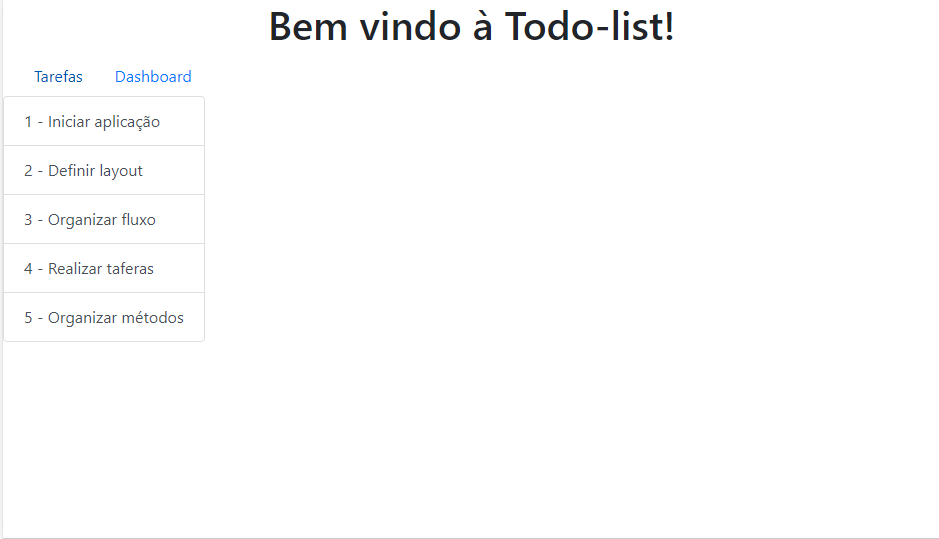
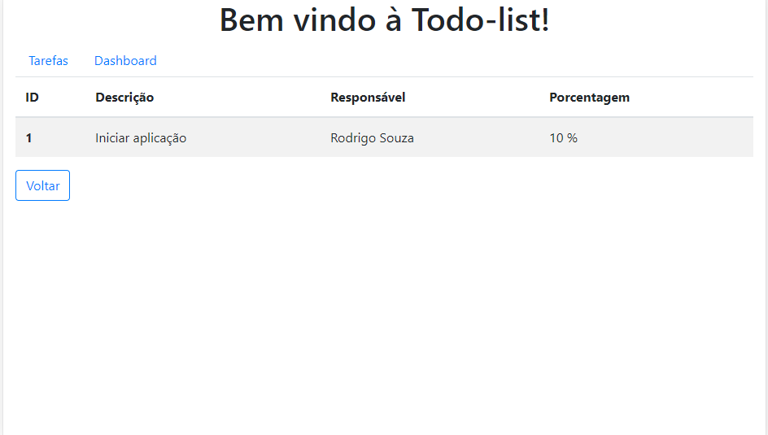
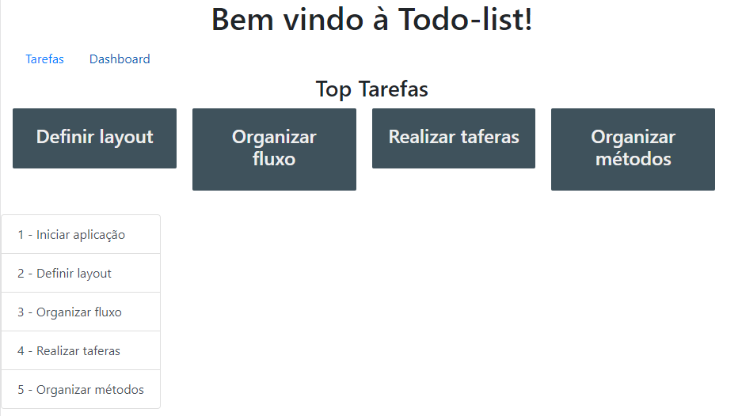

# TO-DO-list
Atividade feita para disciplina de tópicos especiais ministrada pelo professor Ely Miranda.

## 1. Exibição de tarefas

As tarefas são exibidas e podem ser acessadas através de cliques.

## 2. Detalhando uma tarefa

Aqui a tarefa detalhada é exibida em uma tabela. Podemos destacar o botão voltar que volta para página anterior.

## 3. Dashboard

Exibe a lista de tarefas em uma grade e permanece mostrando a lista de tarefas que também é clicável.
